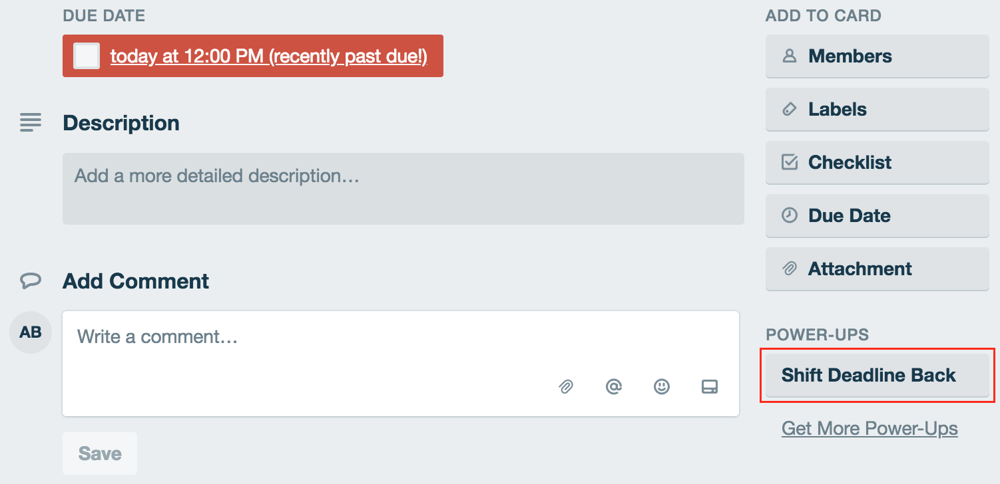

# Trello Power-Up: Easy Due Dates

Easy Due Dates is a simple Trello Power-Up that makes use of Trello's REST API and Client Library. 

The Power-Up adds a button to cards that allows users to push the due dates one day back. 

